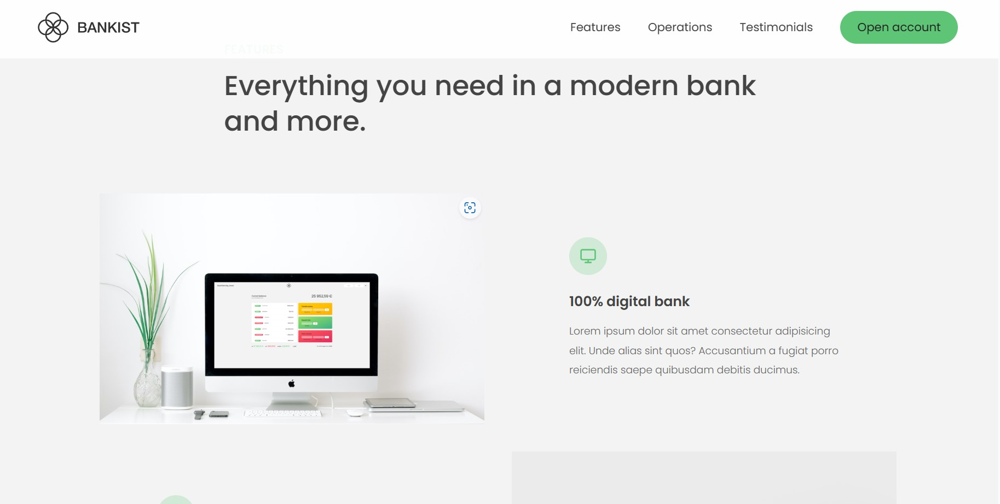

# Bankist-App
Bankist is a fictitious website centered around banking, designed specifically for practicing JavaScript DOM manipulations. The website incorporates various features to showcase these manipulations, including
- DOM traversing
- lazy loading of images
- a slider component
- implementation of a sticky navigation.

These features have been implemented to obtain practical experience in utilizing JavaScript to manipulate the Document Object Model, a crucial aspect of web development.

This website is built using the JavaScript programming language and is hosted on the Cloudflare platform.

 
 

 
**Languages**

**URL**

[https://bankist.pages.dev](https://bankist-app.pages.dev/)
